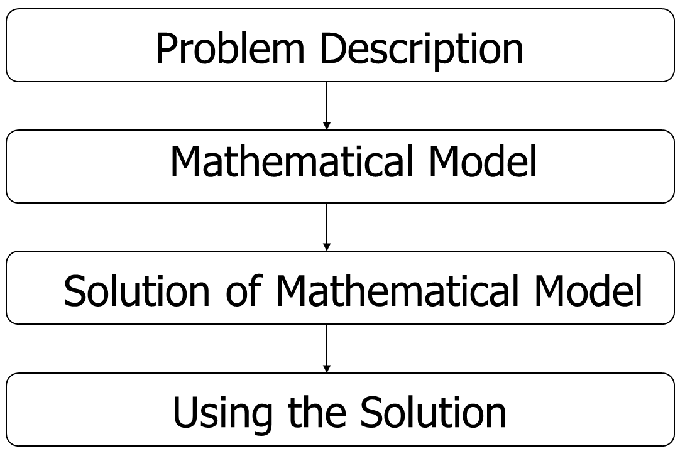

# UNAC-FIME-NUMERICAL-METHODS

## Introduction: Computational Methods for Engineers – Numerical Methods

Numerical methods are the backbone of modern engineering and science. They provide computational techniques to approximate solutions for mathematical problems that are too complex, time-consuming, or even impossible to solve analytically. Instead of relying on exact formulas, numerical methods employ algorithms, iteration, and computer power to deliver accurate and practical solutions.

This course introduces the fundamental numerical techniques used in engineering, including:

* Solving systems of linear and nonlinear equations.
* Interpolation and curve fitting.
* Numerical differentiation and integration.
* Root-finding and optimization methods.
* Solving ordinary and partial differential equations.
* Visualization of results for interpretation and decision-making.

Beyond the methods themselves, the course emphasizes best practices in computation: how to choose the right algorithm, balance efficiency with accuracy, and interpret the limitations of approximate solutions. Students will also explore the philosophy of computation and visualization, learning not only how to compute but also why computations behave the way they do.

By the end of the course, students will be able to:

* Implement and analyze numerical algorithms on a computer.
* Understand error propagation and accuracy limitations in floating-point arithmetic.
* Apply root-finding, optimization, and interpolation to real-world problems.
* Solve and simulate differential equations modeling engineering and physical systems.
* Visualize data and solutions effectively to extract insights.

### Why Numerical Methods Matter

* No analytical solution: Many equations, such as nonlinear ODEs or PDEs, lack closed-form solutions.
* Intractable solutions: Exact solutions may exist but are impractical to compute by hand for large systems.
* Engineering applications: From modeling fluid flow and simulating structures to machine learning and data fitting, numerical computation enables engineers to solve problems that are otherwise unsolvable.

### Key Aspects of Numerical Computation

1. Approximation: Transforming complex continuous problems into simpler discrete approximations.
2. Iteration: Refining solutions through repeated computational steps until desired accuracy is achieved.
3. Trade-offs: Balancing precision, computational cost, and efficiency.
4. Error analysis: Identifying, estimating, and minimizing numerical errors.
5. Algorithms & tools: Designing efficient algorithms and implementing them with programming languages and specialized software.

In essence, this course is not only about solving equations but about thinking computationally: using algorithms, data, and visualization to understand and predict real-world phenomena.

